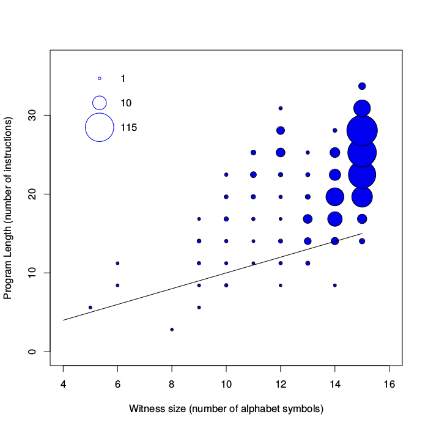

# The-Teaching-Size-with-P3
Software related to the paper "The Teaching Size: Computable Teachers and Learners forUniversal Languages"

The experiments are based on the [P3](https://en.wikipedia.org/wiki/Brainfuck) Language. 

The file [learnp3.c](learnp3.c) contains a P3 compiler built in C. This library is called by the Python script [lp3-py](lp3.py). This Script generates witness sets  and calls the C library in order to learn a P3 program that cover every witness set.
The file [res7.txt](res7.txt) contains the result of the witness sets and the P3 program for all the witness sets with less than 8 alphabet symbols.

The R script [filterprogsTS.R](filterprogsTS.R) is used to generate the [teaching book](filteredprogsTS7.txt) as well as some useful plot for the analysis of the results.

This software has been developed by [Cèsar Ferri](http://users.dsic.upv.es/~cferri/), [Jan Arne Telle](http://www.ii.uib.no/~telle/) and [José Hernández-Orallo](http://josephorallo.webs.upv.es/).

